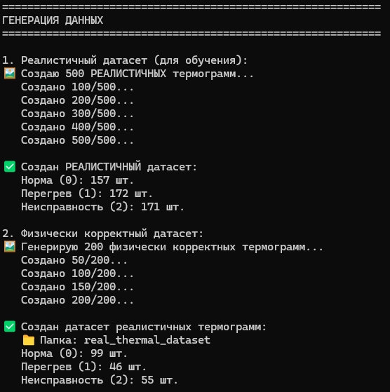
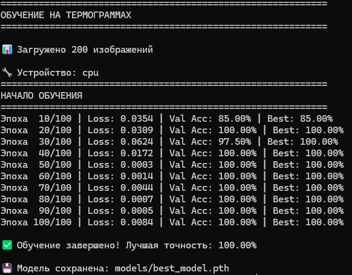
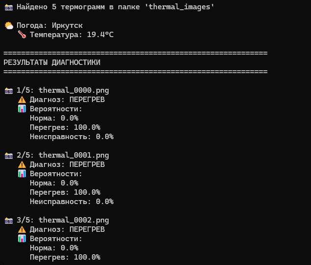
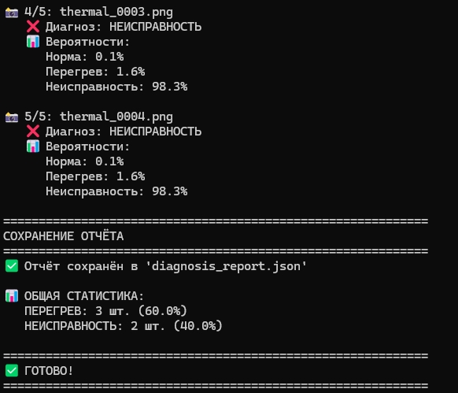
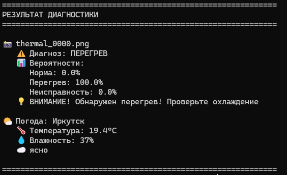

# thermal-diagnosis
Нейросетевая диагностика электрооборудования по термограммам. Определяет: НОРМА / ПЕРЕГРЕВ / НЕИСПРАВНОСТЬ
# 🔥 Термографическая диагностика электрооборудования

[](https://www.python.org/)
[](https://pytorch.org/)
[](LICENSE)
[](https://github.com/SmailsZX/thermal-diagnosis/stargazers)

## 📌 О проекте

Нейросетевая система для диагностики состояния электрооборудования по термограммам.  
Определяет три класса состояния:

| Статус | Описание | Действие |
|--------|----------|----------|
| ✅ **НОРМА** | Оборудование в штатном режиме | Плановое обслуживание |
| ⚠️ **ПЕРЕГРЕВ** | Повышенная температура | Проверить охлаждение |
| ❌ **НЕИСПРАВНОСТЬ** | Критический дефект | Немедленный ремонт |

---

## 📸 Демонстрация работы

### 1. Генерация синтетических данных



### 2. Обучение нейросети



### 3. Анализ термограмм (папка)




### 4. Диагностика одного файла



---

## 🚀 Особенности

- ✅ Обучение на реалистичных термограммах
- 🌤️ Интеграция с OpenWeatherMap (погода в Иркутске)
- 📊 Подробный отчёт в JSON
- 🖼️ Пакетная обработка изображений
- 🎨 Визуализация в стиле тепловизора (colormap INFERNO)

---

## 📂 Структура проекта
thermal-diagnosis/
├── src/ # Исходный код
│ ├── utils.py # Вспомогательные функции
│ ├── generate_data.py # Генерация данных
│ ├── train.py # Обучение модели
│ ├── predict.py # Анализ одного файла
│ └── analyze_folder.py # Анализ папки
├── models/ # Сохранённые веса
│ └── best_model.pth
├── data/ # Датасеты
├── notebooks/ # Jupyter демо
├── scripts/ # Вспомогательные скрипты
└── screenshots/ # Скриншоты для README

---

## ⚡ Быстрый старт

### 1. Клонирование
```bash
git clone https://github.com/SmailsZX/thermal-diagnosis.git
cd thermal-diagnosis
Установка зависимостей
pip install -r requirements.txt
Генерация данных
python src/generate_data.py
Обучение модели
python src/train.py
Анализ термограмм
# Одно изображение
python src/predict.py --image thermal_images/thermal_0000.png

# Вся папка
python src/analyze_folder.py --folder thermal_images/

🌤️ Погодный API
Для корректной работы анализа требуется API-ключ OpenWeatherMap:

Зарегистрируйтесь на OpenWeatherMap

Получите API-ключ

Установите переменную окружения:
export WEATHER_API_KEY="your_api_key"
📊 Пример вывода

📸 1/3: thermal_0001.png
   ⚠️ Диагноз: ПЕРЕГРЕВ
   📊 Вероятности:
      Норма: 10.2%
      Перегрев: 85.7%
      Неисправность: 4.1%
   💡 ВНИМАНИЕ! Обнаружен перегрев! Проверьте охлаждение

🌤️ Погода в Иркутске:
   🌡️ Температура: -5.2°C
   💧 Влажность: 78%

🧠 Архитектура сети
ImprovedThermalNet:
├── Conv2d(1→64) + BN + ReLU + MaxPool
├── Conv2d(64→128) + BN + ReLU + MaxPool
├── Conv2d(128→256) + BN + ReLU + MaxPool
├── Conv2d(256→512) + BN + ReLU + AdaptiveAvgPool
├── Dropout(0.3)
├── Linear(512→256) + ReLU + Dropout(0.3)
├── Linear(256→128) + ReLU
└── Linear(128→3)

📈 Результаты
Метрика	Значение
Точность на валидации	~85-90%
Размер изображения	224×224
Классы	3 (Норма, Перегрев, Неисправность)

🛠️ Технологии
PyTorch — глубокое обучение
OpenCV — обработка изображений
NumPy — вычисления
scikit-learn — разделение данных
Requests — API погоды

📝 Лицензия
MIT License

🤝 Вклад
PR приветствуются! Для крупных изменений откройте Issue для обсуждения.
